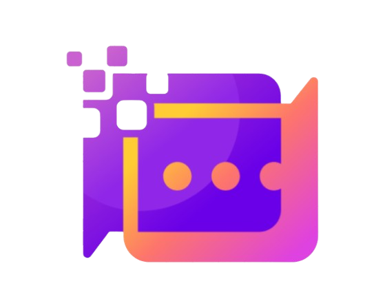

# ChatVault — AI Conversation Manager for VS Code

> Capture, persist, search and manage every AI chat session across IDE sessions. Works with Copilot, Cursor, and Windsurf!

[<!-- PLACEHOLDER FOR LICEcap or Kap GIF HERE -->]

## Why ChatVault?
AI chat in IDEs is ephemeral — conversations vanish, there's no log, no search, no way to revisit what worked. ChatVault solves this by automatically capturing and persisting every AI conversation across sessions, with full CRUD and a fast hybrid search engine.

## Features
- 🚀 **Auto-Capture:** Automatically captures AI chat sessions from within the IDE.
- 💾 **Local-First SQLite Storage:** Fast, private, and capable of holding 100,000+ chats.
- 🔍 **Hybrid Search:** Instant Fuzzy & FTS5 ranked search.
- ☁️ **BYOB Cloud Sync (Pro):** Sync across devices using your own free Supabase project.

## Get Started
Install from the [VS Code Marketplace](https://marketplace.visualstudio.com/items?itemName=akashkumarjha.chatvault) or [Open VSX](https://open-vsx.org/extension/akashkumarjha/chatvault).
